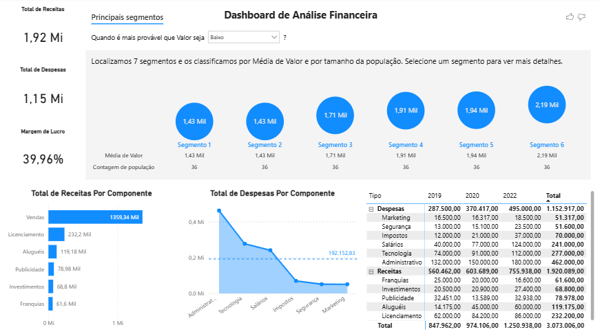

# 📊 Dashboard de Análise Financeira

Este projeto faz parte do curso Microsoft Power BI para Business Intelligence e Data Science, e consiste na construção de um dashboard interativo para análise financeira, com foco na visualização de receitas, despesas e segmentação de clientes com base em comportamento de valor.

---

##  Tecnologias utilizadas

* Power BI (visualização e modelagem)
* Excel / CSV (fonte de dados)
* DAX (medidas e cálculos)

---

##  Principais análises

O dashboard permite explorar:

* **Receita total:** 1,92 Mi
* **Despesas totais:** 1,15 Mi
* **Margem de lucro:** 39,96%

###  Segmentação de clientes

* Os dados foram agrupados em **7 segmentos**
* Classificação baseada em:

  * Média de valor
  * Tamanho da população

Isso permite identificar quais grupos geram mais receita.

---

Alguns pontos importantes observados:

* A maior parte da receita vem de **vendas**
* Despesas administrativas e tecnológicas representam grande parte dos custos
* Existe concentração de receita em poucos segmentos, indicando oportunidade de diversificação

---

Neste projeto, trabalhei com:

* Modelagem de dados
* Criação de medidas com DAX
* Construção de visualizações claras e intuitivas
* Análise exploratória de dados (EDA)
* Storytelling com dados

---

## Preview do Dashboard

---

